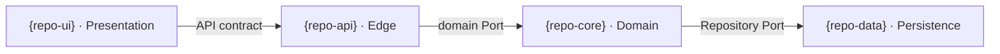

# Architecture RACI + Component Map — {PROJECT_NAME}

> **Living INTENT doc (ADR-001).** The canonical "who owns what + don't dupe" boundary map.
> **Hand-curated, ADR-gated, validated against the code import graph** (drift fails the lane-lint).
> Lives at `docs/architecture/raci-component-map.md`. The per-repo machine-checkable rules live at
> each repo's `docs/architecture/lane-rules.txt` (format at the bottom).

## Governance

| | |
|---|---|
| **Owns / maintains** | CTO (project-wide) |
| **Changes via** | ADR only — never silent drift |
| **Validated by** | the NAVIGATION engine's cross-repo import graph (Phase 2) — divergence fails `lane-boundary-lint` |
| **Per-repo UML** | VP-Eng (generated from the AST on initiation; never hand-drawn — ADR-001) |

## Component / RACI matrix

| Component (repo) | Lane | Owns (R) | Exposes (contract) | Consumes (contract) | Forbidden cross-lane imports |
|---|---|---|---|---|---|
| `{repo-core}` | Domain | the domain model + rules | `Port` interfaces | — | persistence drivers · UI · HTTP |
| `{repo-data}` | Persistence | the datastore adapter | `Repository` impl of the Port | the Port interface | UI · domain rules |
| `{repo-api}` | Edge | request/response handling | the HTTP/MCP surface | domain Ports | a datastore driver directly |
| `{repo-ui}` | Presentation | the user surface | — | the API contract | domain internals · datastore |

> One row per repo/component. The **Forbidden cross-lane imports** column is the source for that
> repo's `lane-rules.txt` (and, in Phase 2, the RACI-validator diffs it against the actual imports).

## Component map (C4-ish — render/refresh via `/arch-map`)



*Detailed class/sequence diagrams are **derived** from the code-graph engine (never hand-drawn) — `/arch-map` regenerates them.*

## Per-repo lane rules (machine-checkable — feeds `lane-boundary-lint`)

Each repo declares its forbidden imports at `docs/architecture/lane-rules.txt`, one rule per
non-`#` line, fields separated by `|||`:

```
<forbidden-import-regex>|||<this-repo's-lane>|||<RACI-rule-id>|||<human message>
```

Example (a Domain repo that must not import a persistence driver):

```
^\s*(import|from)\s+surrealdb|||Domain|||R-3.2|||Domain logic must not import a persistence driver — go through the Repository Port.
```
